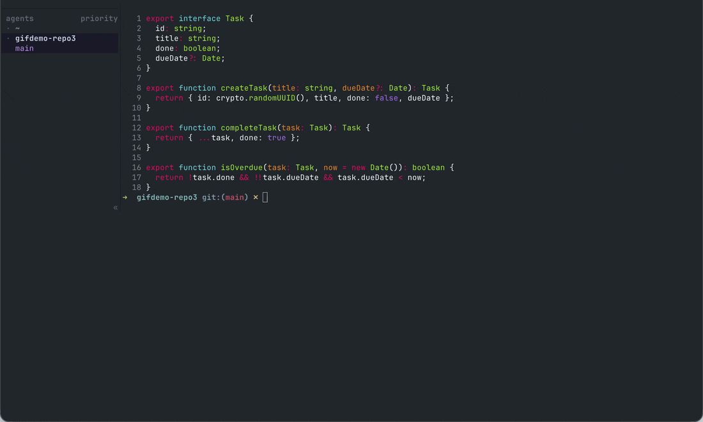
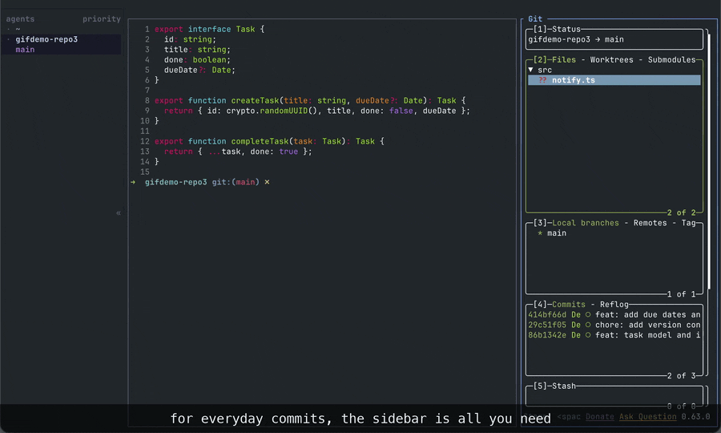
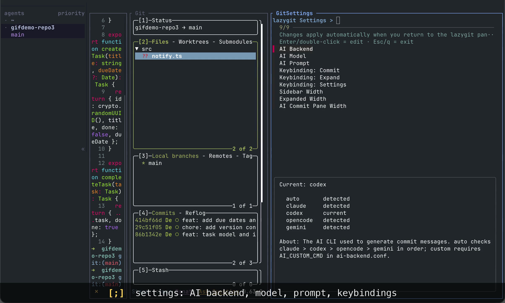
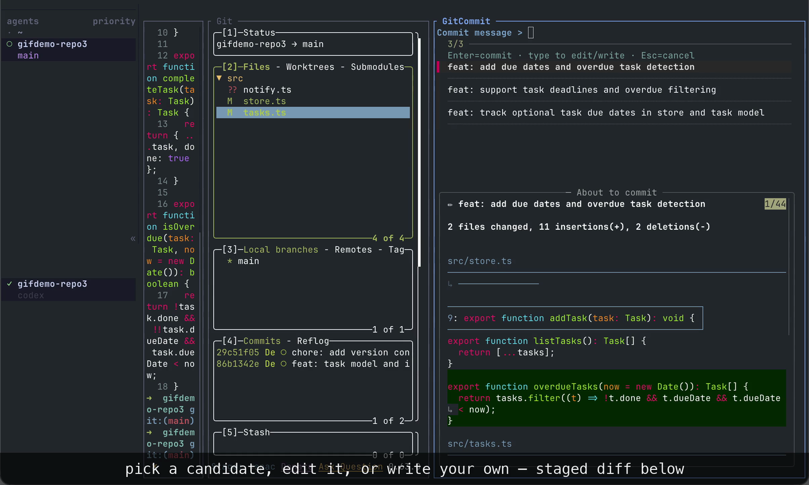

# herdr-lazygit

[](https://github.com/Crokily/herdr-lazygit/actions/workflows/runtime-tests.yml)
[](https://github.com/Crokily/herdr-lazygit/releases)
[](LICENSE)




<sub>Demo recorded automatically by Fable 5 with the [promo-gif](https://github.com/Crokily/colys-agent-lab/tree/main/skills/promo-gif) skill.</sub>

[中文文档](README.zh-CN.md)

A [herdr](https://herdr.dev) plugin that runs [lazygit](https://github.com/jesseduffield/lazygit) in a narrow sidebar pane, with AI commit message generation. Press one key to open the sidebar, one key to expand it into the full lazygit layout, and one key to commit with an AI-written message.

## Quick start

### Let an AI agent install it

Copy this prompt into an AI coding agent running on the machine where you use herdr:

```text
Install and configure herdr-lazygit from https://github.com/Crokily/herdr-lazygit for me. Follow the repository README and work idempotently: check that herdr >= 0.7.0 and the required tools are available; run `herdr plugin install crokily/herdr-lazygit`; use the installed herdr CLI/help to locate my active `config.toml`; back it up; and add the documented `prefix+g` and `prefix+shift+g` plugin-action keybindings only if they are missing. Do not overwrite unrelated settings or create duplicate bindings. If either key already has a different binding, stop and show me the conflict instead of choosing a replacement. Reload the herdr config, verify that the plugin is installed and the config reload succeeds, then report exactly what you changed. Do not use sudo or install system packages.
```

The AI CLI used by the optional commit-message feature is separate from installation. The git sidebar, staging, history, sync, and layout features work without an AI CLI; only `C` requires one.

### Install manually

Requires herdr >= 0.7.0 plus `bash`, `git`, and Python >= 3.7 (`python3`) on `PATH`. The build also needs `curl` or `wget`, `tar`, and `sha256sum` or `shasum`.

```sh
herdr plugin install crokily/herdr-lazygit

# or pin a released version:
herdr plugin install crokily/herdr-lazygit --ref v0.3.0
```

Add the launcher keybindings to your active herdr `config.toml`:

```toml
[[keys.command]]              # lazygit: open in a split
key = "prefix+g"
type = "plugin_action"
command = "herdr-lazygit.open"

[[keys.command]]              # lazygit: open in its own tab
key = "prefix+shift+g"
type = "plugin_action"
command = "herdr-lazygit.open-tab"
```

Herdr 0.7.0 gives its default new-worktree binding priority on `prefix+shift+g`.
For this binding, set `new_worktree = []` in your existing `[keys]` table (or
assign that action another key). Otherwise Herdr disables the plugin binding
with a config warning.

Run `herdr server reload-config`. `prefix+g` then behaves as: not open → open in a split; open but unfocused → focus; focused → close.

New splits start in the compact sidebar layout. New tabs (`prefix+shift+g`)
start expanded so the diff is visible immediately. If a matching lazygit pane
already exists, the action reuses it and preserves its layout and placement;
`open-tab` can also reuse a split in the same workspace.

Choose **Initial Split Layout** and **Initial Tab Layout** in Settings, or set
`DEFAULT_MODE_SPLIT=sidebar` / `DEFAULT_MODE_TAB=expanded` in `panel.conf`.
Each accepts `sidebar` or `expanded`; invalid values warn and use that
variant's default. Preferences apply only to new panes. Set
`DEFAULT_MODE_TAB=sidebar` to restore the previous tab startup behavior.
Expanded splits use `EXPAND_COLS`, leaving space for the other pane; a
single-pane tab always keeps its full width. Your final `lazygit-user.yml`
layer still wins if it explicitly overrides the layout's GUI fields.

Press `U` repeatedly to switch between sidebar and expanded layouts. Each
keypress reloads the layout immediately, including while lazygit stays focused.

On Herdr 0.9, opening or switching to a Git tab uses an explicit `tab focus`
to update the visible client, because the plugin pane APIs alone only update
server focus. Herdr's public tab focus is session-wide: other clients attached
to that same server can switch too. Plugin action context does not expose a
client ID, so this version cannot guarantee a switch confined to the invoking
client. Repeated actions still reuse the matching repository's Git pane.

Launcher failures now report their stage in `herdr plugin log list --plugin
herdr-lazygit` and attempt a short, silent Herdr notification. Lock waiting is
bounded to 2 seconds; commands have a 3-second limit and the launcher has a
10-second overall budget (plus at most 0.5 seconds for notification delivery).
Independent servers/workspaces do not block each other. A timed-out creation
may already have opened a pane: check it before retrying. Do not delete lock
files or kill every launcher as a recovery step.

### Herdr Remote

When attaching with `herdr --remote`, Herdr uses local keybindings by default. In current Herdr releases, that local keybinding profile intentionally omits every `[[keys.command]]` entry, including `type = "plugin_action"`. As a result, the launcher bindings above do not work in the default remote mode—even if the same bindings are also present in the local machine's `config.toml`.

Detach and reattach using the remote server's keybindings instead:

```sh
herdr --remote <host> --remote-keybindings server
```

Add `--session <name>` as usual when attaching to a named session. The keybinding policy is selected when attaching, so `herdr server reload-config` does not change it for an already attached remote client. See the [Herdr remote access documentation](https://herdr.dev/docs/persistence-remote/) for details.

## Daily workflow

Press `prefix+g`. A 42-column git sidebar opens next to your current directory. Press it again and the sidebar closes; the launcher never opens a second copy.

A typical commit:

1. **Stage**: the sidebar lists changed files with M/A/D status colors. `Space` (or double-click) stages a file — no expansion needed;
2. **Commit**: press `C`. A commit pane opens immediately, shows the backend and model, and runs a spinner while the AI reads the staged diff. It then lists 3 candidate messages, with the full selected message, a change summary, and the complete staged diff rendered below. Select a candidate, edit it in the input line, or type your own message, then press Enter to commit;
3. **Sync**: `p` pull, `P` push, `f` fetch.

For everyday commits, the sidebar is all you need. When you want a deeper look — full diff view, history, stash, hunk-by-hunk staging with `Enter` — press `U` to expand into the complete lazygit layout, and `U` again to collapse back.



## The three plugin keys

The plugin adds exactly three keybindings. Everything else is stock lazygit (press `?` inside lazygit for the built-in list):

| Key | Verb | What it does |
| --- | --- | --- |
| `C` | **Commit** | Opens the AI commit pane: generate, select or edit, commit |
| `U` | **Expand** | Toggles between the compact sidebar and the full lazygit layout |
| `;` | **Settings** | Opens the settings pane |

All three keys are remappable from the settings pane. The mouse works throughout: click to select, double-click to stage, wheel to scroll.

## The settings pane (`;`)

Press `;` from anywhere in lazygit. A settings pane (fzf-driven, keyboard and mouse) opens beside the sidebar:

- **AI backend**: claude / codex / opencode / gemini. Default is auto-detection in that order;
- **AI model**: set per backend. Defaults are `haiku` for claude, `google/gemini-2.5-flash` for opencode, `gemini-2.5-flash` for gemini, and the Codex CLI's configured default for codex. If you want codex pinned to a specific model, set `AI_CODEX_MODEL`;
- **AI prompt**: opens the prompt file in `$EDITOR`. Edit it to change the language or format of generated messages;
- **Keys**: remap C / U / ; by pressing the new key. Keys that collide with a lazygit built-in are rejected, and the conflicting binding is shown;
- **Initial layouts**: choose sidebar or expanded independently for new splits and tabs;
- **Widths**: sidebar, expanded layout, and commit pane columns.

Key changes take effect when the lazygit pane regains focus. Initial-layout
preferences apply to new panes only; use `U` to change a running pane.
If a handwritten key conflicts after a runtime update, the generator warns
and selects a free plugin key. Settings shows the effective binding alongside
the saved preference. It does not disable built-in keys or rewrite `keys.conf`;
the documented default `C` exception remains. Analysis checks the runtime's
default bindings; personal YAML remappings remain under your control.



## What AI commit requires

One of these CLIs installed and logged in: `claude`, `codex`, `opencode`, `gemini`. No API keys are needed; the plugin calls the CLI's non-interactive mode under your existing login. When generation fails, the commit pane shows a hint line starting with `(` that names the backend and the error; press any key to close. `Ctrl-C` cancels a running generation.

### AI data disclosure

Pressing `C` sends the staged diff plus the prompt text for this plugin to the selected AI CLI on this machine. If the staged diff fits within the configured `DIFF_MAX_CHARS` budget (8,000 by default), it is sent unchanged; otherwise the plugin sends a structured sample with a per-file overview (status plus `+/-` line counts for every staged file that fits in the budget, plus a marker when rows are omitted) and then a bounded patch sample.

That CLI then forwards the request to its provider's service under **your** account; that provider's billing, retention, and privacy policies apply. Nothing is sent at any other time. The plugin itself collects nothing and has no telemetry.



## Runtime and advanced installation

During a GitHub install, the plugin downloads pinned private copies of lazygit 0.65.0 and fzf 0.74.4, verifies repository-pinned SHA-256 digests, and stores them under its managed `bin/` directory. It never invokes Homebrew, a system package manager, or `sudo`.

### Why a private lazygit?

The plugin generates lazygit configuration — customCommands, keybindings, layout — tested against exactly lazygit 0.65.0, and its settings menu relies on fzf 0.74.4 features. Pinning private copies means the same plugin version behaves the same on every machine, and users without lazygit get a working pane with no package-manager side effects. The private binaries never enter `PATH` and never conflict with a Homebrew or distro lazygit.

### Your existing lazygit config

The pane loads your own lazygit config file (from the directory `lazygit --print-config-dir` reports) as the base layer, so your theme and settings apply inside the pane. The plugin's layers merge over it — keys the plugin owns still win, and `$HERDR_PLUGIN_CONFIG_DIR/lazygit-user.yml` keeps the final say. Set `INHERIT_USER_CONFIG=0` in `$HERDR_PLUGIN_CONFIG_DIR/panel.conf` to opt out. If your personal config was written for a newer lazygit and the pinned one rejects it, the pane stays open and shows the error instead of closing silently.

### Using your own binaries

Absolute paths in `$HERDR_PLUGIN_CONFIG_DIR/panel.conf` bypass the private runtime:

```sh
RUNTIME_LAZYGIT_BIN='/opt/homebrew/bin/lazygit'
RUNTIME_FZF_BIN='/opt/homebrew/bin/fzf'
```

A version other than the pinned one prints a warning and is unsupported — generated keybindings and config may misbehave.

### Installing behind a firewall

The runtime downloads from GitHub releases. If the build cannot reach GitHub, run the installer manually with mirror overrides (paths mirror the upstream `releases/download` layout); repository-pinned SHA-256 digests still verify whatever the mirror serves:

```sh
HERDR_LAZYGIT_LAZYGIT_BASE_URL='https://your-mirror/jesseduffield/lazygit/releases/download' \
HERDR_LAZYGIT_FZF_BASE_URL='https://your-mirror/junegunn/fzf/releases/download' \
  /bin/sh scripts/install-runtime.sh
```

### Local development

`herdr plugin link` does not run the manifest's `[[build]]` command, so prepare the private runtime before linking a checkout:

```sh
cd /path/to/herdr-lazygit
/bin/sh scripts/install-runtime.sh
herdr plugin link "$PWD"
```

> **Action context:** foreground keybindings capture the invoking pane and cwd.
> The launcher keeps that target even if another client changes focus while
> it is running. If the source pane moved or closed, the action fails rather
> than opening elsewhere. A manual invocation without action context resolves
> the current pane once. For remote work, run the plugin on the pane's host;
> selecting another machine in the UI does not retarget a pane's inherited socket.

## Reference

### Key details

- `C` reads **staged** content only — stage first, then press. It overrides the files panel's built-in "commit using git editor" binding; rebind that in `lazygit-user.yml` if you use it. One `GitCommit` pane exists per tab.
- `U` is a global binding that toggles the current pane's per-instance layout layer between `sidebar` and `expanded`. Expanded width defaults to 110 columns and leaves at least 20 columns for the sibling region. New splits default to sidebar and new tabs to expanded; other panes keep their own mode.
- `U` and `;` are the defaults produced by a free-key analysis of every lazygit 0.65.0 built-in binding: candidate `Z` is taken by `universal.redo`; `Ctrl+S` and `O` collide with the filtering menu and the PR menu; `U` and `;` are unbound in every panel (full occupancy matrix in [DESIGN.md](DESIGN.md) Appendix A). The key-picking rule: plugin keys must not shadow commonly used lazygit built-ins. `v` (range select) and `V` (cherry-pick paste) stay stock for the same reason.
- Keys persist in `$HERDR_PLUGIN_CONFIG_DIR/keys.conf`.

### AI backend config file

The settings pane writes `$HERDR_PLUGIN_CONFIG_DIR/ai-backend.conf` (shell-sourceable). It can also be edited by hand — the `custom` backend requires it:

```sh
# auto | claude | codex | opencode | gemini | custom
AI_BACKEND=auto

# Used when AI_BACKEND=custom: the command reads prompt+diff on stdin, prints the message to stdout
AI_CUSTOM_CMD=""
```

`detected` in the settings pane means the CLI is installed; it does not guarantee the CLI is logged in or eligible. Failure hints include the backend name and a one-line stderr summary.

### Config layers

The plugin loads four plugin-managed lazygit config layers via `LG_CONFIG_FILE`; later layers win:

1. The bundled base layer `lazygit-config.yml` (factory settings — do not edit; plugin updates overwrite it)
2. The generated global layer `$HERDR_PLUGIN_CONFIG_DIR/generated.yml` (written from keys/customCommands — machine-generated, do not edit)
3. The per-pane layout layer `$HERDR_PLUGIN_CONFIG_DIR/layout-<pid>-<epoch>.yml` (written on pane start and by `U`; stores only this pane's sidebar/expanded state)
4. Your override layer `$HERDR_PLUGIN_CONFIG_DIR/lazygit-user.yml` (created on first run; always last, always wins)

Scalar settings are overridden field by field. `customCommands` entries accumulate across layers, and the later file wins on the same key + context, so the override layer can replace any plugin command. The per-pane layout layer owns the mode-dependent `sidePanelWidth` plus `expandFocusedSidePanel: true` and `portraitMode: never`; the base layer enables mouse support and disables random tips. Neither sets a Nerd Font (add `gui.nerdFontsVersion: "3"` to your override layer if you use one).

To remap a plugin key, use the settings pane (stored in `keys.conf`). To remap a lazygit built-in, add a `keybinding` section to `lazygit-user.yml`.

### Layout

```
herdr-plugin.toml            # plugin manifest
lazygit-config.yml           # bundled base config (factory layer)
DESIGN.md                    # design doc: three-verb model, key rules, config layers
THIRD_PARTY_NOTICES.md       # licenses for downloaded lazygit/fzf binaries
bin/                         # generated private lazygit + fzf runtime (not committed)
demo/                        # maintainer-only, reproducible demo choreography
docs/media/                  # final media referenced by this README
scripts/
  install-runtime.sh         # install-time: download + verify the private runtime
  runtime-versions.sh        # pinned lazygit/fzf versions
  launcher.py                # shared bounded split/tab launcher
  launcher-config.sh         # shell preference/runtime precheck
  process_helper.py          # child deadlines and process-group cleanup
  runtime-env.sh             # resolve runtime tools by absolute path
  run-lazygit.sh             # pane entrypoint: regenerate config layer, run lazygit
  open-lazygit.sh            # action: open in a split (idempotent open/focus/toggle)
  open-lazygit-tab.sh        # action: open in a tab
  ai-commit-msg.sh           # AI commit message generation / backend & model management
  open-ai-commit-pane.sh     # Commit handler: opens the GitCommit pane
  ai-commit-pane.sh          # spinner + fzf candidate/preview UI + git commit
  toggle-expand.sh           # Expand handler: mode, geometry, focus-in hot reload
  open-settings-pane.sh      # Settings handler: opens the settings pane
  settings-fzf.sh            # the fzf menu loop inside the settings pane
  gen-config-layer.sh        # keys.conf -> generated.yml (machine-generated layer)
  layout-layer.sh            # per-pane layout layer read/write helpers
  free-keys.py               # keybinding occupancy analysis / conflict check
  layout-helper.py           # absolute pane geometry over the herdr socket
tests/                       # hermetic installer, runtime, launcher, layout, and AI tests
```

Per-user state lives in `$HERDR_PLUGIN_CONFIG_DIR` (falls back to `~/.config/herdr-lazygit`):

```
keys.conf                    # plugin keys: KEY_COMMIT / KEY_ZOOM / KEY_SETTINGS
panel.conf                   # initial split/tab layouts, widths, optional INHERIT_USER_CONFIG / RUNTIME_* overrides
ai-backend.conf              # AI backend / per-backend model
prompt.txt                   # custom AI commit prompt
generated.yml                # machine-generated global lazygit layer — do not edit
layout-<pid>-<epoch>.yml     # machine-generated per-pane layout layer — do not edit
lazygit-user.yml             # your lazygit overrides — always wins
```

The design rationale — the three-verb model, the split between lazygit (git interactions) and herdr (window management), key-picking rules, and capability boundaries — is documented in [DESIGN.md](DESIGN.md).
See the [maintenance validation record](docs/maintenance-validation.md) for
tested Herdr versions and remaining platform/remote checks, and the
[Windows review](docs/windows-review.md) for the candidate contribution and CI plan.

## License

This repository is licensed under the [MIT License](LICENSE). The bundled lazygit/fzf runtime is covered separately in [THIRD_PARTY_NOTICES.md](THIRD_PARTY_NOTICES.md).
