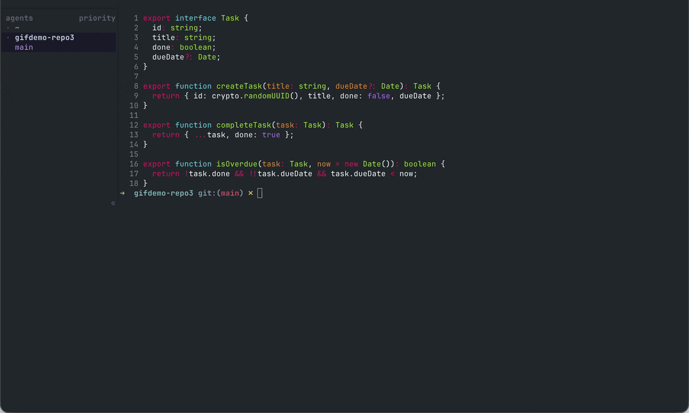
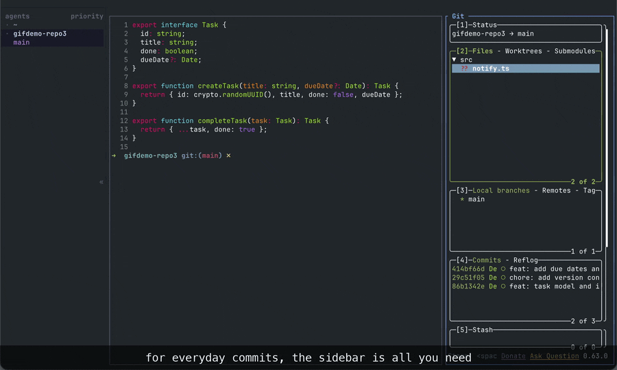
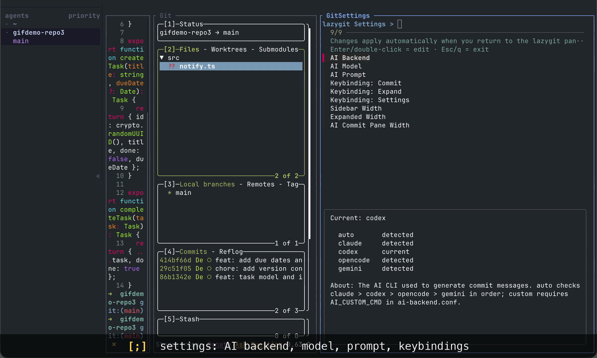
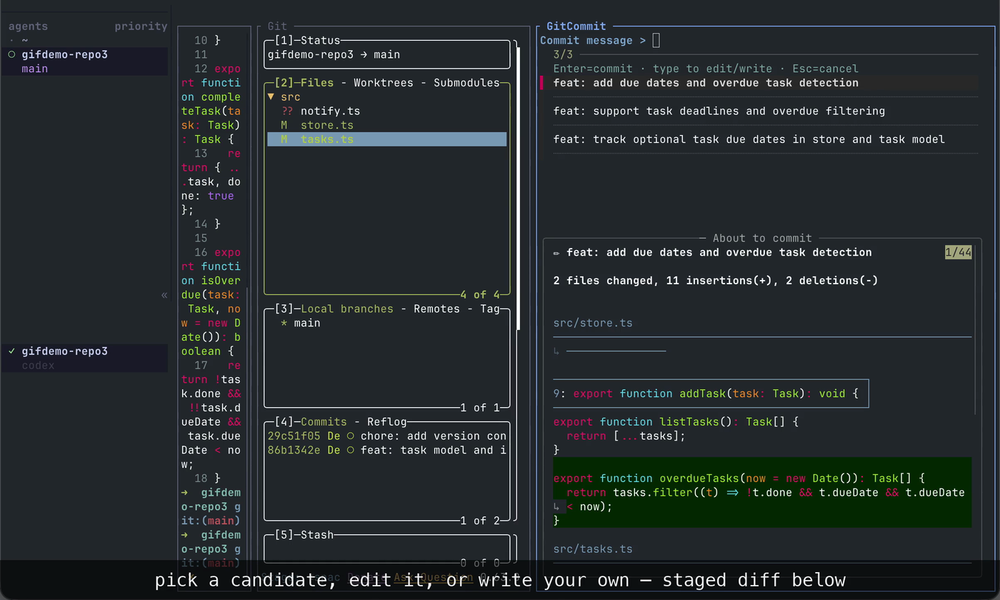

# herdr-lazygit



<sub>演示 GIF 由 Fable 5 使用 [promo-gif](https://github.com/Crokily/colys-agent-lab/tree/main/skills/promo-gif) skill 自动录制。</sub>

[English](README.md)

一个 [herdr](https://herdr.dev) 插件：在窄侧栏 pane 里运行 [lazygit](https://github.com/jesseduffield/lazygit)，内置 AI 生成 commit message。一个键打开侧栏，一个键展开成完整 lazygit 布局，一个键用 AI 写好的 message 提交。

## 快速开始

### 让 AI agent 自动安装

把下面这段 prompt 复制给运行在你使用 herdr 那台机器上的 AI coding agent：

```text
请帮我安装并配置 https://github.com/Crokily/herdr-lazygit。严格遵循仓库 README，并确保操作幂等：检查 herdr >= 0.7.0 以及必需工具是否可用；运行 `herdr plugin install crokily/herdr-lazygit`；通过已安装的 herdr CLI/help 查找当前生效的 `config.toml`；先备份该文件；仅在缺失时添加 README 中的 `prefix+g` 和 `prefix+shift+g` plugin-action 键位。不要覆盖无关设置，也不要创建重复绑定。如果任一键已经绑定到其他功能，请停止并把冲突展示给我，不要自行选择替代键。然后 reload herdr 配置，验证插件已安装且配置 reload 成功，最后准确报告修改了哪些内容。不要使用 sudo，也不要安装系统级软件包。
```

AI commit message 所使用的 AI CLI 与插件安装是两回事。Git 侧栏、stage、历史、同步和布局功能都不依赖 AI CLI；只有按 `C` 生成 message 时才需要。

### 手动安装

要求 herdr >= 0.7.0，并确保 `bash`、`git`、Python >= 3.7（`python3`）在 `PATH` 上。构建阶段还需要 `curl` 或 `wget`、`tar`，以及 `sha256sum` 或 `shasum`。

```sh
herdr plugin install crokily/herdr-lazygit
```

在当前生效的 herdr `config.toml` 中添加启动键位：

```toml
[[keys.command]]              # lazygit：分屏打开
key = "prefix+g"
type = "plugin_action"
command = "herdr-lazygit.open"

[[keys.command]]              # lazygit：独立 tab 打开
key = "prefix+shift+g"
type = "plugin_action"
command = "herdr-lazygit.open-tab"
```

执行 `herdr server reload-config`。之后 `prefix+g` 的行为是：未打开 → 分屏打开；已打开但未聚焦 → 聚焦；已聚焦 → 关闭。

## 日常工作流

按 `prefix+g`，当前目录旁边打开一条 42 列的 git 侧栏；再按一次关闭。启动器是幂等的，不会开出第二个。

一次典型的提交：

1. **暂存**：侧栏列出所有改动文件，带 M/A/D 状态色。`空格`（或双击）stage 文件——不需要展开；
2. **提交**：按 `C`，commit pane 立即打开，显示后端与模型，AI 读取 staged diff 期间显示进度动画，然后列出 3 条候选 message，下方同时展示选中候选的完整内容、一行改动统计、以及 delta 渲染的完整 staged diff。选一条候选、在输入行编辑它、或直接输入自己的 message，回车提交；
3. **同步**：`p` pull、`P` push、`f` fetch。

日常提交，窄侧栏就够了。想深入查看时——完整 diff 视图、历史、stash、按 `Enter` 逐块 stage——按 `U` 展开成完整 lazygit 布局，再按 `U` 收回。



## 插件的三个键

插件只新增三个键位，其余全部是 lazygit 原生操作（在 lazygit 里按 `?` 查看内置键位表）：

| 键 | 动词 | 作用 |
| --- | --- | --- |
| `C` | **Commit** | 打开 AI commit pane：生成、选择或编辑、提交 |
| `U` | **Expand** | 在窄侧栏与完整 lazygit 布局之间切换 |
| `;` | **Settings** | 打开设置页 |

三个键都可以在设置页重映射。鼠标全程可用：单击选中、双击 stage、滚轮滚动。

## 设置页（`;`）

在 lazygit 任意面板按 `;`，侧栏旁边打开设置页（fzf 驱动，键盘鼠标均可）：

- **AI 后端**：claude / codex / opencode / gemini，默认按此顺序自动探测第一个已安装的；
- **AI 模型**：按后端分别设置。默认值分别是 claude 用 `haiku`、opencode 用 `google/gemini-2.5-flash`、gemini 用 `gemini-2.5-flash`、codex 用 Codex CLI 当前配置的默认模型。若你想把 codex 固定到某个模型，请设置 `AI_CODEX_MODEL`；
- **AI Prompt**：用 `$EDITOR` 打开 prompt 文件，修改它可以改变生成 message 的语言和格式；
- **键位**：按下新键即可重映射 `C` / `U` / `;`。与 lazygit 内置键冲突时会被拒绝，并显示被哪个绑定占用；
- **宽度**：侧栏、展开布局、commit pane 的列宽。

改动在 lazygit pane 重新获得焦点时生效——lazygit 在 focus 时热重载配置文件，无需重启。



## AI 提交的前置条件

安装并登录以下任意一个 CLI：`claude`、`codex`、`opencode`、`gemini`。不需要配置 API key，插件调用 CLI 的非交互模式，使用你已有的登录态。生成失败时 commit pane 显示以 `(` 开头的提示行，包含后端名和错误摘要，按任意键关闭；生成过程中 `Ctrl-C` 取消。

### AI 数据披露

按下 `C` 时，插件会把当前已暂存的 diff 和本插件的 prompt 文本发送给这台机器上选中的 AI CLI。如果 staged diff 没超过配置的 `DIFF_MAX_CHARS` 预算（默认 8,000），就原样发送；超过时则发送结构化采样：先附上一个按预算裁剪的 per-file 概览（能放下的每个文件都会带状态与 `+/-` 行数，省略时会追加提示行），再附上受预算限制的 patch 样本。

随后由该 CLI 以 **你的** 账号把请求转发到对应服务商；计费、数据保留和隐私政策都以该服务商为准。除此之外不会在其他时刻发送任何内容。插件本身不收集任何数据，也没有遥测。



## Runtime 与高级安装

通过 GitHub 安装时，插件会下载固定版本的私有 lazygit 0.63.0 与 fzf 0.74.0，用仓库内固定的 SHA-256 校验值验证后存入 Herdr 管理的插件 `bin/` 目录。安装过程不会调用 Homebrew、系统包管理器或 `sudo`。

### 为什么自带一份 lazygit？

插件生成的 lazygit 配置（customCommands、键位、布局）是针对 lazygit 0.63.0 精确测试的，settings 菜单依赖 fzf 0.74.0 的特性。钉住私有副本意味着同一插件版本在每台机器上的行为一致，没装过 lazygit 的用户也能零副作用地获得可用的面板。私有二进制不进入 `PATH`，与 Homebrew 或发行版安装的 lazygit 互不干扰。

### 你已有的 lazygit 配置

面板会把你自己的 lazygit 配置文件（目录由 `lazygit --print-config-dir` 报告）作为最底层加载，你的主题和设置在面板内继续生效。插件的配置层合并在其上——插件占用的键仍然胜出，`$HERDR_PLUGIN_CONFIG_DIR/lazygit-user.yml` 拥有最终决定权。在 `$HERDR_PLUGIN_CONFIG_DIR/panel.conf` 中设置 `INHERIT_USER_CONFIG=0` 可关闭继承。如果你的个人配置面向更新版 lazygit、被钉住的版本拒绝，面板会保持打开并显示错误，而不是无声关闭。

### 使用你自己的二进制

在 `$HERDR_PLUGIN_CONFIG_DIR/panel.conf` 中写入绝对路径即可绕过私有 runtime：

```sh
RUNTIME_LAZYGIT_BIN='/opt/homebrew/bin/lazygit'
RUNTIME_FZF_BIN='/opt/homebrew/bin/fzf'
```

版本与钉住版本不一致时会打印警告，且不在支持范围内——生成的键位和配置可能行为异常。

### 网络受限时安装

runtime 从 GitHub releases 下载。如果构建无法访问 GitHub，请手动带镜像变量运行安装脚本（路径沿用上游 `releases/download` 布局）；仓库内固定的 SHA-256 校验值仍会验证镜像返回的内容：

```sh
HERDR_LAZYGIT_LAZYGIT_BASE_URL='https://your-mirror/jesseduffield/lazygit/releases/download' \
HERDR_LAZYGIT_FZF_BASE_URL='https://your-mirror/junegunn/fzf/releases/download' \
  /bin/sh scripts/install-runtime.sh
```

### 本地开发

`herdr plugin link` 不会执行 manifest 中的 `[[build]]`，因此 link 本地 checkout 前需要先准备私有 runtime：

```sh
cd /path/to/herdr-lazygit
/bin/sh scripts/install-runtime.sh
herdr plugin link "$PWD"
```

> **注意（herdr 平台行为）**：action 的上下文永远取自 herdr 当前 **UI 聚焦**的 pane，而不是后台进程。它会把 lazygit 开在用户聚焦 pane 旁边、使用该 pane 的 cwd，并聚焦新 pane。只通过前台键位绑定触发这两个 action。

## 细节备查

### 键位细节

- `C` 只读取 **staged** 内容——先 stage 再按。它覆盖了 files 面板内置的「用 git editor 提交」键位；如果需要该功能，在 `lazygit-user.yml` 里重新绑定。每个 tab 同时只有一个 `GitCommit` pane。
- `U` 是全局键位，切换当前 pane 自己的布局层： `sidebar` 与 `expanded`。展开宽度默认 110 列，上限为 tab 总宽减 20。每个新 pane 都从侧栏模式开始，其他 pane 保持自己的模式不变。
- `U` 和 `;` 是对 lazygit 0.63.0 全部内置键位做空闲键分析得出的默认值：候选 `Z` 被 `universal.redo` 占用；`Ctrl+S` 和 `O` 分别与过滤菜单、PR 菜单冲突；`U` 和 `;` 在所有面板均无绑定（完整占用矩阵见 [DESIGN.md](DESIGN.md) 附录 A）。选键规则：插件键位不遮蔽 lazygit 常用内置键。`v`（范围选择）和 `V`（cherry-pick 粘贴）因此保持原生。
- 键位持久化在 `$HERDR_PLUGIN_CONFIG_DIR/keys.conf`。

### AI 后端配置文件

设置页写入 `$HERDR_PLUGIN_CONFIG_DIR/ai-backend.conf`（shell 可 source 格式），也可以手动编辑——`custom` 后端必须手动配置：

```sh
# auto | claude | codex | opencode | gemini | custom
AI_BACKEND=auto

# AI_BACKEND=custom 时使用：命令从 stdin 读入 prompt+diff,stdout 输出 message
AI_CUSTOM_CMD=""
```

设置页里的 `detected` 表示 CLI 已安装，不保证已登录或有使用资格。失败提示会包含后端名和一行 stderr 摘要。

### 配置层

插件通过 `LG_CONFIG_FILE` 加载四层由插件管理的 lazygit 配置，越靠后优先级越高：

1. 插件捆绑的基础层 `lazygit-config.yml`（出厂设置——请勿修改，插件更新会覆盖）
2. 全局生成层 `$HERDR_PLUGIN_CONFIG_DIR/generated.yml`（由键位/customCommands 生成——机器生成，勿手改）
3. 每个 pane 自己的布局层 `$HERDR_PLUGIN_CONFIG_DIR/layout-<pid>-<epoch>.yml`（pane 启动时创建，按 `U` 时改写；只保存这个 pane 的 sidebar/expanded 状态）
4. 用户覆盖层 `$HERDR_PLUGIN_CONFIG_DIR/lazygit-user.yml`（首次启动自动创建；永远排最后，永远赢）

普通字段按字段覆盖；`customCommands` 跨层累加，同 key + context 时靠后的文件赢，所以覆盖层可以整条替换插件的任何命令。每个 pane 的布局层负责随模式变化的 `sidePanelWidth`，并固定 `expandFocusedSidePanel: true` 和 `portraitMode: never`；基础层开启鼠标支持、关闭随机 tip。两层都不设置 Nerd Font（需要图标时在覆盖层加 `gui.nerdFontsVersion: "3"`）。

重映射插件键位：用设置页（存储在 `keys.conf`）。重映射 lazygit 内置键位：在 `lazygit-user.yml` 里加 `keybinding` 段。

### 文件结构

```
herdr-plugin.toml            # 插件 manifest
lazygit-config.yml           # 捆绑的基础配置(出厂层)
DESIGN.md                    # 设计文档：三动词模型、选键规则、配置层
THIRD_PARTY_NOTICES.md       # 下载的 lazygit/fzf 二进制许可证
bin/                         # 构建生成的私有 lazygit + fzf runtime(不提交)
demo/                        # 仅供维护者使用的可复现演示脚本
docs/media/                  # 本 README 实际引用的最终媒体
scripts/
  install-runtime.sh         # 安装时下载并校验私有 runtime
  runtime-versions.sh        # 固定的 lazygit/fzf 版本
  runtime-env.sh             # 用绝对路径解析 runtime 工具
  run-lazygit.sh             # pane 入口：重新生成配置层后 exec lazygit
  open-lazygit.sh            # action：分屏打开(幂等 open/focus/toggle)
  open-lazygit-tab.sh        # action:tab 打开
  ai-commit-msg.sh           # AI commit message 生成 / 后端与模型管理
  open-ai-commit-pane.sh     # Commit handler：打开 GitCommit pane
  ai-commit-pane.sh          # 进度动画 + fzf 候选/预览 UI + git commit
  toggle-expand.sh           # Expand handler：模式、几何、focus-in 热重载
  open-settings-pane.sh      # Settings handler：打开设置 pane
  settings-fzf.sh            # 设置 pane 里的 fzf 循环菜单
  gen-config-layer.sh        # keys.conf -> generated.yml(机器生成层)
  layout-layer.sh            # 每个 pane 的布局层读写辅助
  free-keys.py               # 键位占用分析 / 冲突校验
  layout-helper.py           # 经 herdr socket 的绝对 pane 几何
tests/                       # installer、runtime、launcher、layout 与 AI 的封闭测试
```

用户态数据在 `$HERDR_PLUGIN_CONFIG_DIR`（回退 `~/.config/herdr-lazygit`）：

```
keys.conf                    # 插件键位：KEY_COMMIT / KEY_ZOOM / KEY_SETTINGS
panel.conf                   # 全局 pane 宽度 + 可选的 INHERIT_USER_CONFIG / RUNTIME_* 覆盖
ai-backend.conf              # AI 后端 / 各后端模型
prompt.txt                   # 自定义 AI commit prompt
generated.yml                # 机器生成的全局 lazygit 配置层——勿手改
layout-<pid>-<epoch>.yml     # 机器生成的每-pane 布局层——勿手改
lazygit-user.yml             # 你的 lazygit 覆盖层——永远赢
```

设计文档 [DESIGN.md](DESIGN.md) 记录了完整的设计依据：三动词模型、lazygit 负责 git 交互 / herdr 负责窗口管理的分工、选键规则、以及能力边界。

## License

本仓库使用 [MIT License](LICENSE)。捆绑的 lazygit/fzf runtime 许可证单独记录在 [THIRD_PARTY_NOTICES.md](THIRD_PARTY_NOTICES.md)。
